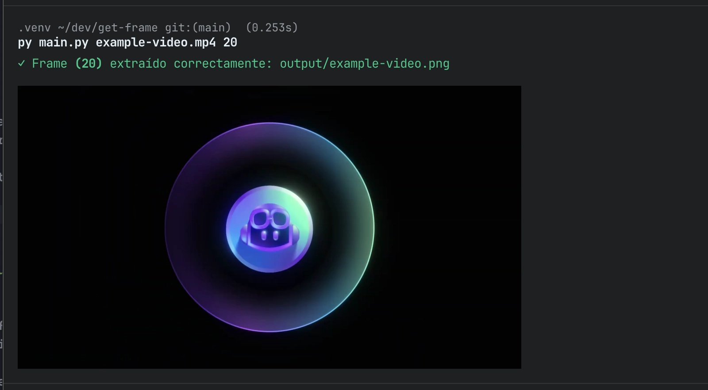

# Video frame retrieval

- Extract a specific video frame
- Save frames as PNG
- Display the result in the terminal using `imgcat`
- Error handling with styled messages
- Argument validation
- Simple command-line interface



## Requirements

- Python 3.8 or newer
- pip (Python package manager)

## Installation

1. Clone the repository or download the project files.

```bash
git clone git@github.com:hectorOliSan/get-frame.git
```

2. Create a virtual environment:

```bash
python -m venv .venv
```

3. Activate the virtual environment:

```bash
source .venv/bin/activate     # Linux/macOS
.venv\Scripts\activate        # Windows
```

4. Install dependencies:

```bash
pip install -r requirements.txt
```

## Project structure

```
get-frame/
├── output/              # Directory where extracted frames are saved
├── main.py              # Main file containing the extractor logic
├── decorators.py        # Decorators for error handling and styling
├── requirements.txt     # Project dependencies
├── .gitignore
└── README.md
```

### Dependencies

- `opencv-python`: Library for video processing and frame extraction
- `numpy`: Numerical operations and arrays
- `imgcat`: Display images in the terminal
- `pillow`: Image processing
- `rich`: Styles and colors for the terminal

## Usage

```bash
python main.py <video_path> <frame_number>
```

- `<video_path>`: Path to the video file from which to extract the frame. Supports common video formats (MP4, AVI, MOV, etc.).
- `<frame_number>`: Frame number to extract. Must be greater than 0 and less than or equal to the total number of frames in the video.

```bash
python main.py video.mp4 10
```

## Output

The extracted frame is saved in the `output/` directory, which is created automatically if it does not exist. The output file keeps the same name as the original video, but with the `.png` extension.

The frame is also displayed directly in the terminal if your terminal supports `imgcat`.
